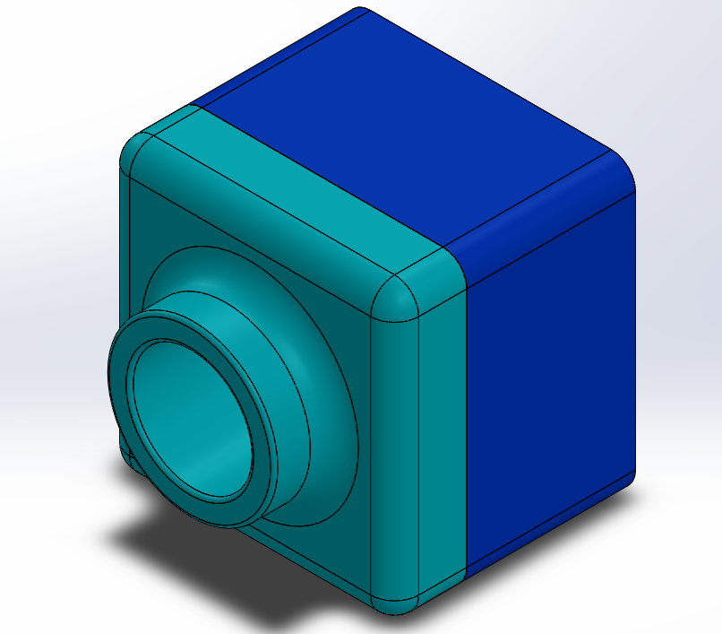

# Not so basic CAD
My Not So Basic CAD assignments
Sweeps and Lofts (candlestick and hammer head) was an assignment re-introducing CAD. I created a Candle stick and A hammer head using the directions from SolidWorks. I learned how to use a lot of new features on SolidWorks, like revolved bases, lofts, and sweeps. This assignment was easy for me because the instructions were really clear. Next time I would work on completing the assignment in a more timely manner. 

The tutor assignments were created to give everyone some extra practice using CAD to make sure that they knew how to use SolidWorks before moving onto some of our bigger assignments. The tutor assignments were pretty easy, but it was hard to find a few of the features that the directions called for. Next time I would have a better understanding for these features, so the assignment would be even easier.

